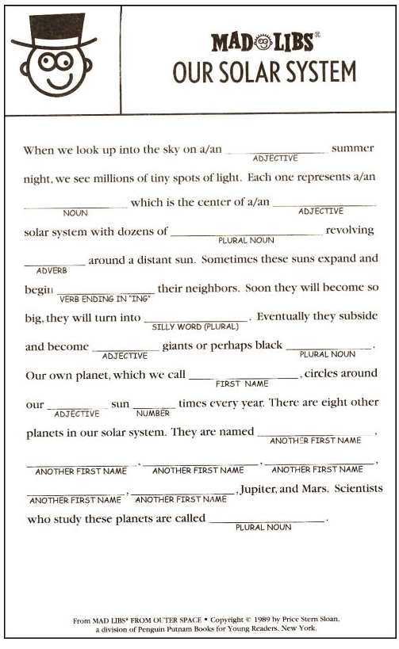

<h1>Thinkful ~ AngularJS App:</h1> 
<h3>ngMadLibs</h3>

"Mad Libs" is a word game that dates back to the 1960s and is still around. It's the sort of game kids will play to keep occupied while riding in the backside of a car with an equally bored sibling on a cross-country family vacation. You are prompted to supply keywords of your choosing: for instance, a proper name, an adjective, a sport, a dessert item. Ater making your choices, you plug each into a preset paragraph long text that has blanks that you fill in with the word choices you've made. Here's an image of an original Mad Lib:

